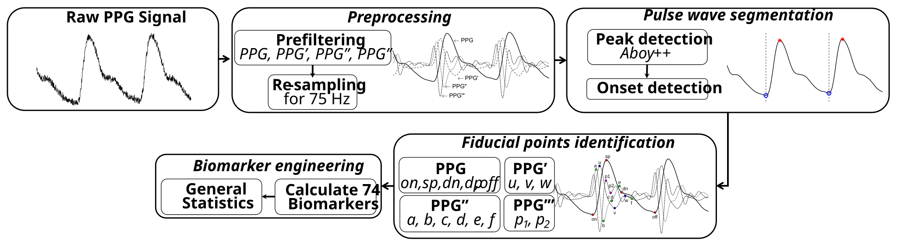
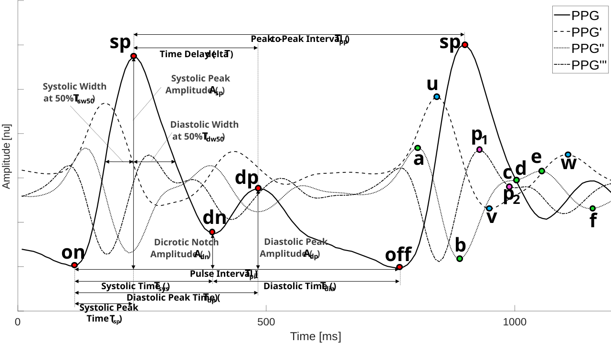
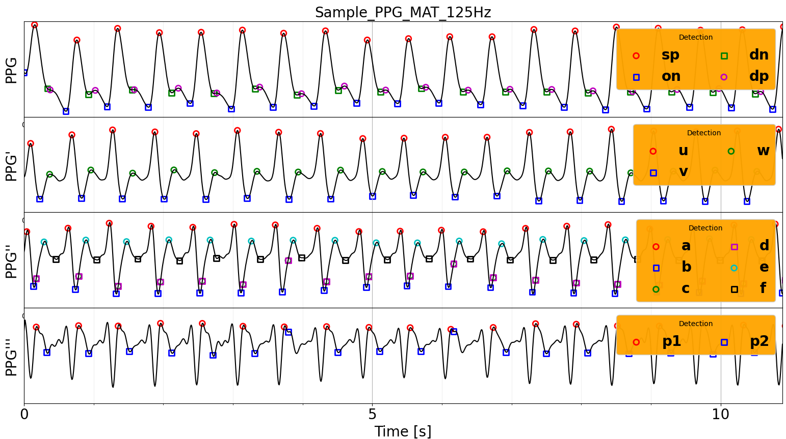

# Beat-to-Beat Blood Pressure Estimation using Machine Learning

## Introduction
pyPPG is a standardised toolbox to analyze long-term finger PPG recordings in real-time. The toolbox extracts state-of-the-art PPG biomarkers (i.e. pulse wave features) from PPG signals. The algorithms implemented in the pyPPG toolbox have been validated on freely available PPG databases. Consequently, pyPPG offers robust and comprehensive assessment of clinically relevant biomarkers from continuous PPG signals.

## Description
The following steps are implemented in the pyPPG toolbox:

1. Loading a raw PPG signal: The toolbox can accept PPG signals in various file formats such as .mat, .txt, .csv, or .edf. These files should contain raw PPG data along with the corresponding sampling rate.
     + .mat: Data should be stored in two variables within the file: (i) ‘Fs’ representing the sampling frequency, and (ii) ‘Data’, a vector containing the raw PPG signal.
     + .txt: The raw PPG signal should be stored in tabular form (single tab or space-delimited), and you need to provide the sampling frequency as an input parameter to the script using ‘fs’.
     + .csv: This format stores raw PPG signal data with comma separation. Similar to .txt, the sampling frequency must be provided as an input parameter to the script using ‘fs’.
     + .edf: The European Data Format is supported, and it applies ‘Pleth’ channel by default. However, if using a different channel name, then the user needs to define it themselves.
2. Preprocessing: The raw PPG signal is filtered to remove noise and artifacts. Subsequently, the first, second, and third derivatives (PPG’, PPG’’, and PPG’”) of the PPG signal are computed and filtered. The resampling of the filtered PPG signal to 75 Hz is specifically performed for systolic peak detection.
3. Pulse wave segmentation: The toolbox employs a peak detector to identify the systolic peaks. It uses an improved version of a beat detection algorithm originally proposed in (Aboy et al. 2005). Based on the peak locations, the toolbox also detects the pulse onsets and offsets, which indicate the start and end of the PPG pulse waves.
4. Fiducial points identification: For each pulse wave, the toolbox detects a set of fiducial points.
5. Biomarker engineering: Based on the fiducial points, a set of 74 PPG digital biomarkers (i.e. pulse wave features) are calculated.

The pyPPG toolbox also provides an optional PPG signal quality index based on the Matlab implementation of the work by (Li et al. 2015).

The toolbox identifies individual pulse waves in a PPG signal by identifying systolic peaks (sp), and then identifying the pulse onset (on) and offset (off) on either side of each systolic peak which indicate the start and end of the pulse wave, respectively.

As example provided below, the pyPPG toolbox facilitates the loading of raw PPG signals from various file formats, including .mat, .csv, .txt, or .edf. This enables then the extraction of fiducial points from PPG signals, encompassing PPG, PPG’, PPG’’, and PPG’’’. Here, the extracted fiducial points are visually represented through plotting:

